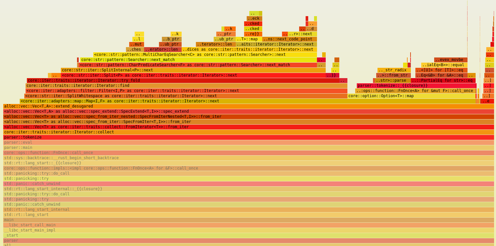
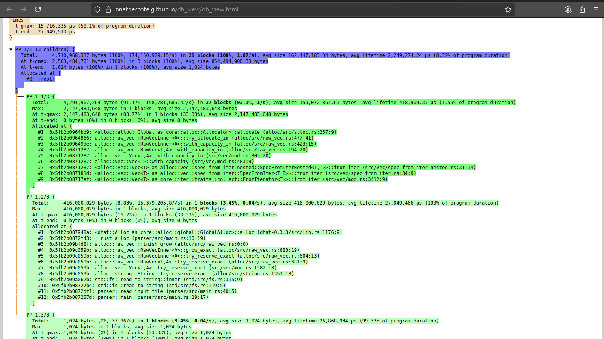
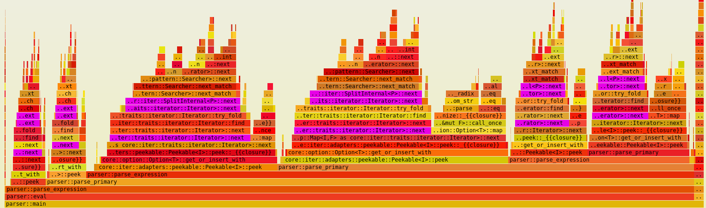

# Optimizing a Math Expression Parser in Rust

## Table of contents

1. [Baseline implementation (43.1 s)](#baseline-implementation-431s)
   1. [How it works](#how-it-works)
   1. [Parser Example: (1 + 2) - 3](#parser-example-1--2---3)
   1. [It works! But we can do better](#it-works-but-we-can-do-better)
2. [Optimizations for speed and memory](#optimizations-for-speed-and-memory)
   1. [Optimization 1: Do not allocate a Vector when tokenizing (43.1 s → 6.45 s, –85% improvement)](#optimization-1-do-not-allocate-a-vector-when-tokenizing-431s--645s--85-improvement)
   1. [Optimization 2: Zero allocations — parse directly from the input bytes (6.45 s → 3.68 s, –43% improvement)](#optimization-2-zero-allocations--parse-directly-from-the-input-bytes-645s--368s--43-improvement)
   1. [Optimization 3: Do not use Peekable (3.68 s → 3.21 s, –13% improvement)](#optimization-3-do-not-use-peekable-368s--321s--13-improvement)
   1. [Optimization 4: Multithreading and SIMD (3.21 s → 2.21 s, –31% improvement)](#optimization-4-multithreading-and-simd-321s--221s--31-improvement)
   1. [Optimization 5: Memory‑mapped I/O (2.21 s → 0.98 s, –56% improvement)](#optimization-5-memory-mapped-io-221s--098s--56-improvement)
3. [Conclusion](#conclusion)


---

In a [previous post](https://rpallas.xyz/1brc/) I explored how to optimize file parsing for max speed. This time, we’ll look at a different, self-contained problem: writing a math expression parser in Rust, and making it as fast and memory-efficient as possible.

Let’s say we want to parse simple math expressions with addition, subtraction, and parentheses. For example:

```
4 + 5 + 2 - 1       => 10
(4 + 5) - (2 + 1)   => 6
(1 + (2 + 3)) - 4   => 2
```

We’ll start with a straightforward implementation and optimize it step by step.


**YOU CAN FIND THE FULL CODE ON:** [https://github.com/RPallas92/math_parser](https://github.com/RPallas92/math_parser)


---

## Baseline implementation (43.1 s)

Here’s the first version of our parser:

```rust
use std::fs;
use std::io::Result;
use std::{iter::Peekable, time::Instant};

fn main() -> Result<()> {
    let total_start = Instant::now();
    let mut step_start = Instant::now();

    let input = read_input_file()?;
   
    println!("Step 1: Input file read in {:?}", step_start.elapsed());

    step_start = Instant::now();
    
    let result = eval(&input);
    
    println!(
        "Step 2: Calculation completed in {:?}",
        step_start.elapsed()
    );

    let total_duration = total_start.elapsed();
    
    println!("--- Summary ---");
    println!("Result: {}", result);
    println!("Total time: {:?}", total_duration);

    Ok(())
}

fn read_input_file() -> Result<String> {
    fs::read_to_string("data/input.txt")
}

fn eval(input: &str) -> u32 {
    let mut tokens = tokenize(input).into_iter().peekable();
    parse_expression(&mut tokens)
}

fn tokenize(input: &str) -> Vec<Token> {
    input
        .split_whitespace()
        .map(|s| match s {
            "+" => Token::Plus,
            "-" => Token::Minus,
            "(" => Token::OpeningParenthesis,
            ")" => Token::ClosingParenthesis,
            n => Token::Operand(n.parse().unwrap()),
        })
        .collect()
}

fn parse_expression(tokens: &mut Peekable<impl Iterator<Item = Token>>) -> u32 {
    let mut left = parse_primary(tokens);

    while let Some(Token::Plus) | Some(Token::Minus) = tokens.peek() {
        let operator: Option<Token> = tokens.next();
        let right = parse_primary(tokens);
        left = match operator {
            Some(Token::Plus) => left + right,
            Some(Token::Minus) => left - right,
            other => panic!("Expected operator, got {:?}", other),
        }
    }

    return left;
}

fn parse_primary(tokens: &mut Peekable<impl Iterator<Item = Token>>) -> u32 {
    match tokens.peek() {
        Some(Token::OpeningParenthesis) => {
            tokens.next(); // consume '('
            let val = parse_expression(tokens);
            tokens.next(); // consume ')'
        }
        _ => parse_operand(tokens),
    }
}

fn parse_operand(tokens: &mut Peekable<impl Iterator<Item = Token>>) -> u32 {
    match tokens.next() {
        Some(Token::Operand(n)) => n,
        other => panic!("Expected number, got {:?}", other),
    }
}

#[derive(Debug, Clone, PartialEq)]
enum Token {
    Operand(u32),
    Plus,
    Minus,
    OpeningParenthesis,
    ClosingParenthesis,
}
```

---

### How it works

Let’s break it down.

The program reads from a file called `input.txt`, which contains a math expression in a single line. That expression is passed to the `eval()` function.

The `tokenize()` function processes the input string, splitting it by whitespace and converting each segment into a token. For example, this input:

```
7 - 3 + 1
```

...is turned into this list of tokens:

```
[Operand(7), Minus, Operand(3), Plus, Operand(1)]
```

The parser then uses a simple recursive strategy:

- `parse_expression()` handles sequences of additions and subtractions.
- `parse_primary()` handles numbers and expressions inside parentheses.
- `parse_operand()` handles the actual integer values.

The recursive call to `parse_expression()` inside `parse_primary()` allows us to evaluate nested expressions (parentheses).

---

### Parser Example: (1 + 2) - 3

Let’s walk through parsing the expression `(1 + 2) - 3` using our functions:

```rust
fn eval(input: &str) -> u32 {
    let mut tokens = tokenize(input).peekable();
    parse_expression(&mut tokens)
}
```

**Input string:** `(1 + 2) - 3`

**Tokens with index:**

| Index | Token                    |
|-------|--------------------------|
| 0     | OpeningParenthesis `(`   |
| 1     | Operand(1)               |
| 2     | Plus `+`                 |
| 3     | Operand(2)               |
| 4     | ClosingParenthesis `)`   |
| 5     | Minus `-`                |
| 6     | Operand(3)               |

We begin by calling `parse_expression` at **depth 1**:

1. **`parse_expression` (depth 1)**  
   - Calls `parse_primary` to get the first value.  

2. **`parse_primary` (depth 2)**  
   - Sees `OpeningParenthesis` at index 0.  
   - Consumes `(` and calls **`parse_expression` (depth 3)** for the parenthesized subexpression.

3. **`parse_expression` (depth 3)**  
   - Calls `parse_primary` (depth 4).

4. **`parse_primary` (depth 4)**  
   - Sees `Operand(1)` at index 1.  
   - Calls `parse_operand` (depth 5), which consumes index 1 and returns `1`.

5. **`parse_expression` (depth 3)** (resuming)  
   - Sees `Plus` at index 2.  
   - Consumes `+` and calls `parse_primary` (depth 4) again.

6. **`parse_primary` (depth 4)**  
   - Sees `Operand(2)` at index 3.  
   - Calls `parse_operand` (depth 5), which consumes index 3 and returns `2`.

7. **`parse_expression` (depth 3)**  
   - Combines `1 + 2 = 3`.  
   - Returns `3` to the caller at depth 2.

8. **`parse_primary` (depth 2)** (resuming)  
   - Now at index 4 sees `ClosingParenthesis`.  
   - Consumes `)` and returns the inner value `3`.

9. **`parse_expression` (depth 1)** (resuming)  
   - Left side is `3`.  
   - Sees `Minus` at index 5.  
   - Consumes `-` and calls `parse_primary` (depth 2).

10. **`parse_primary` (depth 2)**  
    - Sees `Operand(3)` at index 6.  
    - Calls `parse_operand` (depth 5), consumes it, and returns `3`.  

11. **`parse_expression` (depth 1)**  
    - Computes `3 - 3 = 0`.  
    - No more operators, so it returns `0` as the final result.

---

### It works! But we can do better

This baseline parser works well, but it's not optimized.

If we compile it in release mode and execute it for the test file of **1.6GB**, it takes **43.87 seconds** to execute on my laptop:

```
Step 1: Input file read in 1.189915008s
Step 2: Calculation completed in 41.876205675s

--- Summary ---
Result: 2652
Total time: 43.06795088s

```

In the following sections, we’ll optimize this parser step by step:

1. Avoid allocating the token list.
2. Use iterators and slices instead of `Vec<Token>`.
3. Parse directly from the input string.

The goal is to make a parser that’s not only simple and correct, but also lean and fast.

Let’s go!

---

## Optimizations for speed and memory

### Optimization 1: Do not allocate a Vector when tokenizing (43.1 s → 6.45 s, –85% improvement)

Let's use [cargo flamegraph](https://github.com/brendangregg/FlameGraph) to visualize the call stack of the current solution and identify areas for optimization.

`cargo flamegraph --dev --bin parser`

We get the following flame graph:



We can see that the majority of the time is spent in the tokenizer function, which reads the input string and allocates a vector of tokens.

To profile memory usage, we can use [dhat](https://github.com/nnethercote/dhat-rs) to generate a profile JSON file and view it at https://nnethercote.github.io/dh_view/dh_view.html:



Notice how **4 GB of RAM** is used just to allocate the token vector!

---


I made a mistake in my initial implementation. Why does the `tokenize` function return a vector if we’re converting it into an iterator later anyway? Let’s just return a lazy iterator directly instead of allocating a vector:

```rust
fn eval(input: &str) -> u32 {
    let mut tokens = tokenize(input).peekable();
    parse_expression(&mut tokens)
}

fn tokenize(input: &str) -> impl Iterator<Item = Token> + '_ {
    input.split_whitespace().map(|s| match s {
        "+" => Token::Plus,
        "-" => Token::Minus,
        "(" => Token::OpeningParenthesis,
        ")" => Token::ClosingParenthesis,
        n => Token::Operand(n.parse().unwrap()),
    })
}
```

If we run the parser again after this small change, the speed improves significantly:

```
Step 1: Input file read in 1.249408413s
Step 2: Calculation completed in 5.204344393s

--- Summary ---
Result: 2652
Total time: 6.45377661s
```

**Wow! From 43 seconds down to just 6.45**. What an improvement. A small mistake can have a huge impact on performance. Fortunately, the flamegraph pointed us straight to the bottleneck!

---

### Optimization 2: Zero allocations — parse directly from the input bytes (6.45 s → 3.68 s, –43% improvement)

After removing the initial `Vec<Token>` allocation, performance improved significantly. But we can still do better.

If we analyze the flamegraph again, we notice that although we no longer allocate a vector of tokens, we’re still splitting the input string by whitespace. This iterator-based approach is a huge improvement, but there is still overhead in processing the string and creating `&str` slices for each token:



The pink/violet boxes correspond to the `split_whitespace` function used by our tokenizer:

```rust
fn tokenize(input: &str) -> impl Iterator<Item = Token> + '_ {
    input.split_whitespace().map(|s| match s {
        "+" => Token::Plus,
        "-" => Token::Minus,
        "(" => Token::OpeningParenthesis,
        ")" => Token::ClosingParenthesis,
        n => Token::Operand(n.parse().unwrap()),
    })
}
```

We're paying a cost for each `split_whitespace` call, which allocates intermediate slices. This churns memory and CPU cycles.

Let’s dive deeper.

#### The idea: Use &[u8]

Instead of working with UTF-8 strings and `&str`, we can use raw bytes (`&[u8]`) and manually scan for digits and operators to avoid temporary string allocations.


Here is our new zero-allocation tokenizer:

```rust
fn read_input_file() -> Result<Vec<u8>> {
    fs::read("data/input.txt")
}

struct Tokenizer<'a> {
    input: &'a [u8],
    pos: usize,
}

impl<'a> Iterator for Tokenizer<'a> {
    type Item = Token;

    fn next(&mut self) -> Option<Self::Item> {
        if self.pos >= self.input.len() {
            return None;
        }

        let byte = self.input[self.pos];

        self.pos += 1;

        let token = match byte {
            b'+' => Some(Token::Plus),
            b'-' => Some(Token::Minus),
            b'(' => Some(Token::OpeningParenthesis),
            b')' => Some(Token::ClosingParenthesis),
            b'0'..=b'9' => {
                let mut value = byte - b'0';
                while self.pos < self.input.len() && self.input[self.pos].is_ascii_digit() {
                    value = 10 * value + (self.input[self.pos] - b'0');
                    self.pos += 1;
                }

                Some(Token::Operand(value))
            }
            other => panic!("Unexpected byte: '{}'", other as char),
        };

        self.pos += 1; // skip whitespace

        return token;
    }
}
```

The only heap allocation occurs when the file is read into a vector. The tokenizer operates on references to that vector of bytes and does not perform any intermediate allocations.

If we execute the program again, we get:

```
Step 1: Input file read in 1.212080967s
Step 2: Calculation completed in 2.471639289s

--- Summary ---
Result: 2652
Total time: 3.683753465s
```

A great improvement! From **6.45 to 3.68 seconds**, nearly 2 seconds faster!
---


### Optimization 3: Do not use Peekable (3.68 s → 3.21 s, –13% improvement)

The new flamegraph shows several samples related to `Peekable`:

- `core::iter::adapters::peekable::Peekable::peek::_{{closure}}`
- `core::iter::adapters::peekable::Peekable::peek`


This is because we wrap our tokenizer in Rust’s `Peekable` adapter, which allows us to inspect the next token without consuming it. We initially used it for look ahead when parsing expressions like `1 + (2 - 3)` to determine whether to continue parsing or return early.

However, in our use case, `peek()` isn't necessary. We can restructure the algorithm to work directly with a plain iterator.

Here's the old version:

```rust
fn parse_expression(tokens: &mut Peekable<impl Iterator<Item = Token>>) -> u32 {
    let mut left = parse_primary(tokens);

    while let Some(Token::Plus) | Some(Token::Minus) = tokens.peek() {
        let operator = tokens.next();
        let right = parse_primary(tokens);
        left = match operator {
            Some(Token::Plus) => left + right,
            Some(Token::Minus) => left - right,
            other => panic!("Expected operator, got {:?}", other),
        };
    }

    left
}
```

And here’s the new version that eliminates `Peekable`:

```rust
fn parse_expression(tokens: &mut impl Iterator<Item = Token>) -> u32 {
    let mut left = parse_primary(tokens);

    while let Some(token) = tokens.next() {
        if token == Token::ClosingParenthesis {
            break;
        }

        let right = parse_primary(tokens);
        left = match token {
            Token::Plus => left + right,
            Token::Minus => left - right,
            other => panic!("Expected operator, got {:?}", other),
        };
    }

    left
}
```

We replaced the `peek()` logic with a `match` on the current token. If it’s a `+` or `-`, we consume the right-hand operand and compute the result. If it’s a closing parenthesis, we `break` (this is an important point: **we no longer manually skip the closing parenthesis after parsing a sub-expression**).

Previously, with `peekable`, we consumed the `(`, parsed the sub-expression, and then had to explicitly `next()` again to discard the `)` after the recursive call. Now, since we're using a flat iterator, we simply let the closing `)` token be returned by `next()`, and our `while let Some(token)` loop handles it. If the token is a `)`, we break out of the loop, and the recursive call returns.

We also simplified `parse_primary` in a similar way:

```rust
fn parse_primary(tokens: &mut impl Iterator<Item = Token>) -> u32 {
    match tokens.next() {
        Some(Token::OpeningParenthesis) => {
            let val = parse_expression(tokens);
            val
        }
        Some(Token::Operand(n)) => n as u32,
        other => panic!("Expected number, got {:?}", other),
    }
}
```

By avoiding `peek()` and handling the tokens linearly, we improve the performance:

```
Step 1: Input file read in 1.116952011s
Step 2: Calculation completed in 2.094806113s

--- Summary ---
Result: 2652
Total time: 3.21178544s
```

From **3.68 to 3.21 seconds**. We are getting faster. Let's continue optimizing!

---

### Optimization 4: Multithreading and SIMD (3.21 s → 2.21 s, –31% improvement)

The next logical step is to parallelize the computation. Ideally, if we have a CPU with 8 cores, we want to split the input file into 8 equal chunks and have each core work on one chunk simultaneously. This should, in theory, make our program up to 8 times faster.

However, this is not as simple as just splitting the file into 8 equal chunks. We are bound by the rules of math and syntax, which introduce two restrictions:

1.  **We cannot split inside parentheses.** A split can only happen at the "top level" of the expression. For example, splitting `((2 + 1)| - 2)` is invalid, and this applies to nested parentheses as well.
2.  **We cannot split at a `-` operator.** Addition is *associative*, meaning `(a + b) + c` is equivalent to `a + (b + c)`. This property allows us to group additions freely. Subtraction, however, is *not* associative: `(a - b) - c` is not the same as `a - (b - c)`. Splitting on a `-` would alter the order of operations and lead to an incorrect result.

These restrictions mean we cannot simply split the file at `(total_size / 8)`. We need a way to find the *closest valid split point* (a `+` sign at the top level) to that ideal boundary.

To find these points, we would need to scan the entire input to identify where all current parentheses are closed. A naive scan for this would be slow, requiring a full pass over the data just to find the split points before the actual work begins. So, is this solution slower (2 passes vs 1 pass)? Not necessarily. We can make the first pass blazing fast by using **SIMD**.

#### The algorithm at a high level

Before diving into the code, let's look at the high-level plan. The entire process is started by our `parallel_eval` function, which follows this data flow:

```
[ Input File ]
      |
      v
.-----------------------.
|     parallel_eval     |
'-----------------------'
      |
      | 1. Find Splits
      v
.----------------------------------.
| find_best_split_indices_simd     |------> [ Split Indices ]
'----------------------------------'             |
      |                                          |
      | 2. Create Chunks                         |
      v                                          |
[ Chunk 1 ] [ Chunk 2 ] ... [ Chunk N ] <--------+
      |         |               |
      |         |               | 3. Process in Parallel
      v         v               v
.------------------------------------.
|          Thread Pool               |
|                                    |
|  eval(c1)  eval(c2) ...  eval(cN)  |
'------------------------------------'
      |
      | 4. Collect Results
      v
[ Result 1, Result 2, ... Result N ]
      |
      | 5. Sum Results
      v
[ Final Answer ]
```

#### What is SIMD?

**SIMD** stands for **S**ingle **I**nstruction, **M**ultiple **D**ata. It's a powerful feature built into modern CPUs. At its core, SIMD allows the CPU to perform the same operation on multiple pieces of data *at the same time*, with a single instruction.

Consider a cashier at a grocery store. A traditional CPU core operates like a cashier scanning items one by one. This is a **scalar** operation, where one instruction processes one piece of data.

```
Scalar Operation (One by one)
Instruction: Is this byte '+'?
      |
      V
[ H | e | l | l | o |   | + |   | W | o | r | l | d ]
  ^--- Processed sequentially --->
```

A SIMD-enabled CPU is like a cashier with a wide scanner that can read the barcodes of an entire row of items in the cart simultaneously. This is a **vector** operation.

```
SIMD Operation (All at once)
Instruction: For all 64 of these bytes, tell me which ones are '+'?
      |
      V
[ H | e | l | l | o |   | + |   | W | o | r | l | d | ... (up to 64 bytes) ]
[ 0 | 0 | 0 | 0 | 0 | 0 | 1 | 0 | 0 | 0 | 0 | 0 | 0 | ... (result mask)  ]
\_______________________________________________________________________/
                         Processed in a single cycle
```

For repetitive tasks, such as searching for a specific character in a long string, the performance gain is great.

##### SIMD example: Finding +

In our project, we need to locate all `+` characters.

**The Scalar Way:**
Without SIMD, we would need a simple `for` loop to check every single byte:

```rust
let mut positions = Vec::new();
for (i, &byte) in input.iter().enumerate() {
    if byte == b'+' {
        positions.push(i);
    }
}
```
This approach is simple and correct, but for a 1.5GB file like ours, this loop would execute 1.5 billion times.

**The SIMD Way:**
With SIMD (specifically, using AVX-512 instructions), the process is different:

1.  **Load:** We load a big chunk of our input string (64 bytes at a time) into a wide 512-bit CPU register.
2.  **Compare:** We use a single instruction (`_mm512_cmpeq_epi8_mask`) to compare all 64 bytes in our register against a template register that contains 64 copies of the `+` character.
3.  **Get Mask:** The CPU returns a single 64-bit integer (`u64`) as a result. This is a **bitmask**. If the 5th bit of this integer is `1`, it indicates that the 5th byte of our input chunk was a `+`.

In a single instruction, we have done the work of 64 loop iterations. While SIMD requires more complex code, the performance gains are worth it.

#### The Code

Here are the two key functions that implement our parallel strategy: `parallel_eval` orchestrates the process, and `find_best_split_indices_simd` uses SIMD to find the valid split points.

```rust
fn parallel_eval(input: &[u8], num_threads: usize) -> i64 {
    if num_threads <= 1 || input.len() < 1000 {
        return eval(input);
    }

    // 1. Find the best places to split the input.
    let split_indices = unsafe { find_best_split_indices_simd(input, num_threads - 1) };

    if split_indices.is_empty() {
        return eval(input);
    }

    // 2. Create the chunks based on the indices.
    let mut chunks = Vec::with_capacity(num_threads);
    let mut last_idx = 0;
    for &idx in &split_indices {
        // Slice from the last index to just before the operator's space.
        chunks.push(&input[last_idx..idx - 1]);
        // The next chunk starts after the operator and its space.
        last_idx = idx + 2;
    }
    chunks.push(&input[last_idx..]);

    // 3. Process all chunks in parallel with Rayon.
    let chunk_results: Vec<i64> = chunks.par_iter().map(|&chunk| eval(chunk)).collect();

    // 4. Since we only split on '+', the final result is the sum of all parts.
    chunk_results.into_iter().sum()
}

#[cfg(target_arch = "x86_64")]
#[target_feature(enable = "avx512f")]
#[target_feature(enable = "avx512bw")]
unsafe fn find_best_split_indices_simd(input: &[u8], num_splits: usize) -> Vec<usize> {
    // Explanation of this function in the next section.
    let mut final_indices = Vec::with_capacity(num_splits);
    if num_splits == 0 {
        return final_indices;
    }

    let chunk_size = input.len() / (num_splits + 1);
    let mut target_idx = 1;
    let mut last_op_at_depth_zero = 0;
    let mut depth: i32 = 0;
    let mut i = 0;
    let len = input.len();

    let open_parens = _mm512_set1_epi8(b'(' as i8);
    let close_parens = _mm512_set1_epi8(b')' as i8);
    let pluses = _mm512_set1_epi8(b'+' as i8);

    'outer: while i + 64 <= len {
        if final_indices.len() >= num_splits {
            break;
        }
        let chunk = _mm512_loadu_si512(input.as_ptr().add(i) as *const _);
        let open_mask = _mm512_cmpeq_epi8_mask(chunk, open_parens);
        let close_mask = _mm512_cmpeq_epi8_mask(chunk, close_parens);
        let plus_mask = _mm512_cmpeq_epi8_mask(chunk, pluses);

        let mut all_interesting_mask = open_mask | close_mask | plus_mask;

        while all_interesting_mask != 0 {
            let j = all_interesting_mask.trailing_zeros() as usize;
            let current_idx = i + j;
            if (open_mask >> j) & 1 == 1 {
                depth += 1;
            } else if (close_mask >> j) & 1 == 1 {
                depth -= 1;
            } else { // Is a '+' operator
                if depth == 0 {
                    last_op_at_depth_zero = current_idx;
                    let ideal_pos = target_idx * chunk_size;
                    if current_idx >= ideal_pos {
                        final_indices.push(current_idx);
                        target_idx += 1;
                        if final_indices.len() >= num_splits {
                            break 'outer;
                        }
                    }
                }
            }
            all_interesting_mask &= all_interesting_mask - 1;
        }
        i += 64;
    }

    // ... scalar remainder and fill logic ...
    while i < len && final_indices.len() < num_splits {
        let char_byte = *input.get_unchecked(i);
        if char_byte == b'(' { depth += 1; }
        else if char_byte == b')' { depth -= 1; }
        else if char_byte == b'+' && depth == 0 {
            last_op_at_depth_zero = i;
            let ideal_pos = target_idx * chunk_size;
            if i >= ideal_pos {
                final_indices.push(i);
                target_idx += 1;
            }
        }
        i += 1;
    }
    while final_indices.len() < num_splits && last_op_at_depth_zero > 0 {
        final_indices.push(last_op_at_depth_zero);
    }
    final_indices
}
```

#### Algorithm Breakdown: `find_best_split_indices_simd`

This function's purpose is to identify the optimal `+` signs for splitting.

##### Step 1: The SIMD Scan

The code enters a main loop, processing the input in 64-byte chunks. Within this loop, it uses `_mm512_cmpeq_epi8_mask` to generate bitmasks. This instruction compares all 64 bytes of the current chunk against a target character and returns a 64-bit integer (`u64`) where the N-th bit is `1` if the N-th byte was a match.

##### Step 2: The serial scan

Next, we combine these masks and iterate only through the "interesting" bits. This is a key step:

```rust
let mut all_interesting_mask = open_mask | close_mask | plus_mask; // This means we are looking for '(', ')' and '+' characters.

while all_interesting_mask != 0 {
    let j = all_interesting_mask.trailing_zeros() as usize; // j is the index of the next found interesting character.
    let current_idx = i + j; // + j because the mask is a u64 little endian, so trailing zeros are the leading 0 in reality
    if (open_mask >> j) & 1 == 1 { // If that char is a '(' we increase the depth (we enter in a sub expression)
        depth += 1;
    } else if (close_mask >> j) & 1 == 1 { // If that char is a ')' we decrease the depth (we exit from a sub expression)
        depth -= 1;
    } else {
        if depth == 0 { // If the depth is 0, we are at a top level, outside of parentheses. And it is a '+' sign.
            last_op_at_depth_zero = current_idx;
            if current_idx >= ideal_pos { // If we have reached the ideal position (chunk / NUM_THREADS). So we add this '+' sign to the splitting indices.
                final_indices.push(current_idx);
                target_idx += 1;
                if final_indices.len() >= num_splits {
                    break 'outer;
                }
            }
        }
    }
    all_interesting_mask &= all_interesting_mask - 1; // Clears the lowest set 1 bit from the mask, as we have processed it already
}
```

This loop does **not** run 64 times. It only runs for the number of set bits in `all_interesting_mask`. To understand how it processes characters from left-to-right, we need to look at two key details:

1.  **`trailing_zeros()` and Little-Endian:** While you might assume `trailing_zeros` starts from the *end* of the string, it's actually the opposite. Modern x86-64 CPUs are **little-endian**. When a block of memory is loaded into a large integer register, the first byte in memory (e.g., `chunk[0]`) becomes the least significant byte (LSB) of the integer. The `trailing_zeros()` instruction counts from this LSB, meaning it always finds the set bit corresponding to the character with the **lowest index** in our chunk.

    ```
    Memory (Bytes in a chunk):
      Byte Index:   0   1   2   3   ...   63
      Content:     '(' '1' '+' '2'  ...   'X'

          |
          |  Load into a 64-bit integer
          v

    Resulting u64 Bitmask:
      Bit Position:  63  ...   3   2   1   0   <-- LSB (The "trailing" end)
      Corresponds to: 'X' ...  '2' '+' '1' '('
    ```
    As you can see, `trailing_zeros` starts from the right of the integer, which corresponds to the left of our string chunk.


2.  **`if (open_mask >> j) & 1 == 1 {`**: This is just to check if there is an open parenthesis at position `j`. If so, we increment our counter `depth`.

3.  **`all_interesting_mask &= all_interesting_mask - 1`**: This is a trick that clears the lowest set 1 bit we just found. On the next iteration, `trailing_zeros` finds the *new* lowest set bit, which corresponds to the character at the *next lowest index*.

This combination allows us to visit every interesting character in the correct, forward order, but without a slow byte-by-byte scan. Inside the loop, we just update our `depth` counter to know if we are at a top level position, and if so, we check if we can add a splitting point.

#### Full example

Let's trace the entire flow with a small, concrete example:

*   **Input String:** `(1-2) + (3-4) + (5-6)` (Length is 23 bytes)
*   **Goal:** Find 1 split point (`num_splits = 1`) to create 2 chunks.
*   **Ideal Split Position:** `1 * (23 / 2) = 11`. We are looking for the first `+` at depth 0 at or after byte 11.

##### Part 1: `find_best_split_indices_simd` runs

The function will scan the input to find the best split point.

```
Input:        ( 1 - 2 )   +   ( 3 - 4 )   +   ( 5 - 6 )
Index:        0 1 2 3 4 5 6 7 8 9 0 1 2 3 4 5 6 7 8 9 0 1 2
                                  1 1 1 1 1 1 1 1 1 1 2 2 2
Depth:        1 1 1 1 1 0 0 0 1 1 1 1 1 0 0 0 1 1 1 1 1 0 0
Ideal Split ->                      ^
```

1.  The code starts scanning. It finds the first `+` at index `7`.
2.  It checks the depth. The `(` at index 0 increased depth to 1, and the `)` at index 5 decreased it back to 0. So, at index 7, `depth == 0`.
3.  It checks the splitting logic: `is current_idx (7) >= ideal_pos (11)?` The answer is **No**. The code continues scanning.
4.  The code finds the next `+` at index `15`.
5.  It checks the depth. The `(` at index 9 and `)` at index 13 have kept the depth at 0.
6.  It checks the splitting logic: `is current_idx (15) >= ideal_pos (11)?` The answer is **Yes!**
7.  **Action:** The code pushes `15` into `final_indices` and immediately breaks out of all loops because it has found the 1 split it was looking for.
8.  The function returns `[15]`.

##### Part 2: `parallel_eval` receives the result

1.  `split_indices` is now `[15]`.
2.  The `for` loop runs once for the index `15`.
    *   It creates the first chunk by slicing from `0` to `15 - 1 = 14`. The chunk is `(1-2) + (3-4)`.
    *   It updates `last_idx` to `15 + 2 = 17`.
3.  The loop finishes. It creates the final chunk by slicing from `17` to the end. The chunk is `(5-6)`.

    ```
    Original:     (1-2) + (3-4)   +   (5-6)
                  <-- chunk 1 -->   <-- chunk 2 -->

    Split Index:                    ^ (15)
    ```

4.  The two chunks, `(1-2) + (3-4)` and `(5-6)`, are sent to the Rayon thread pool.
5.  Thread 1 gets `(1-2) + (3-4)`, calls `eval`, and gets the result `-2`.
6.  Thread 2 gets `(5-6)`, calls `eval`, and gets the result `-1`.
7.  `collect()` gathers the results into a vector: `[-2, -1]`.
8.  Finally, `sum()` adds them together: `-2 + -1 = -3`.

The final answer is **-3**, which is correct. The entire process worked perfectly.


#### Result

In summary, by using SIMD, we can perform an initial, extremely fast pass to identify optimal split points in the input, and then process each chunk in parallel. I believe a similar technique is employed by the popular [simdjson](https://github.com/simdjson/simdjson) library.

I executed the code on my Surface laptop, and here are the results:


```
Step 1: Input file read in 1.199915008s

Step 2: Calculation completed in 1.010507822s

--- Summary ---
Result: 2652
Total time: 2.210422830s
```


From **3.21 to 2.21 seconds**. 1 second faster, for an already optimized program. Good!

---

### Optimization 5: Memory-Mapped I/O (2.21 s → 0.98 s, –56% improvement)

After profiling the memory usage of our parallel solution, we can see that we're still allocating a very large buffer on the heap to hold the entire file's contents.

`mmap` (memory-mapped files) can be more efficient than standard file I/O because it avoids extra copying from kernel to user space, and allows the operating system to manage memory for us.

When I initially tried `mmap` with the single-threaded version of the code, the performance gain was negligible. However, now that our program is multithreaded, let's re-evaluate its impact.


#### Kernel Space vs. User Space

- **Kernel space**: The privileged area where the operating system runs, managing hardware, I/O, and the page cache.
- **User space**: The unprivileged area where our application code executes, including your heap buffers, stacks, and other program data.
- **Page cache**: A kernel-managed buffer that temporarily stores file data in memory to speed up subsequent access.


#### Cost of fs::read

1. **Double Memory Footprint**  
   ``` 
   [ Disk ] → [ Page Cache ] (1.5 GB)  
             → [ Heap Vec<u8> ] (1.5 GB)  
   ```
   This process involves loading the file into kernel space and then copying it to user space.

2. **False Sharing Contention**
   Modern CPUs transfer data between main memory and CPU caches in 64-byte blocks called "cache lines." False sharing occurs when multiple threads access *different* variables that happen to reside on the same cache line. If one thread modifies its variable, the entire cache line is invalidated for all other threads, forcing them to re-fetch it from memory even though their own data hasn't changed.
   ```
   // Thread 1 writes to data at byte 8
   // Thread 2 writes to data at byte 40
   // Both bytes are in the same 64-byte cache line (0-63).
   // The cache line "bounces" between the cores, causing delays.
   ```
   With a single large `Vec<u8>`, the boundaries of the chunks processed by each thread could easily fall in a way that causes this contention.


#### mmap improvement

Instead of reading the entire file into a `Vec<u8>`, we can map it directly into memory with `mmap`. This gives us:

```rust
use memmap2::Mmap;

fn read_input_file() -> std::io::Result<Mmap> {
    let file = File::open("data/input.txt")?;
    unsafe { Mmap::map(&file) }
}
```

This approach avoids the extra copy performed by `fs::read` and does not allocate the file's content in user space memory.

```
[ Disk ] → [ Page Cache (1.5 GB) ] ↔ [ mmap view in user space ]
```

I also think it is faster because we don't have false sharing with mmap. It hands us the file in 4 KB pages. Threads get whole pages:

```
Thread 1 works on data starting at Page 0 (byte 0)
Thread 2 works on data starting at Page N (byte N*4096)
```
Since pages (4 KB) are much larger than cache lines (64 B), threads operate on memory regions that are physically far apart, preventing them from contending over the same cache lines. I'm not entirely certain about this, but it's my conclusion after reading a lot about the topic and consulting various LLM models.


#### Code Changes

The change is minimal. The `read_input_file` function now returns an `Mmap` object, which is passed directly to the `parallel_eval` function. This allows the operating system to efficiently map the file directly into our process memory on demand:

```rust
use memmap2::Mmap;

fn read_input_file() -> Result<Mmap> {
    let file = File::open("data/input.txt")?;
    unsafe { Mmap::map(&file) }
}

fn main() -> Result<()> {
    let mmap = read_input_file()?;
    let result = parallel_eval(&mmap, NUM_THREADS);
    println!("Result: {}", result);
    Ok(())
}
```

#### Performance Results

```
Step 1: Input file read in 18.8 µs  
Step 2: Calculation completed in 981.2 ms  
**Total time:** 981.3 ms
```

From **2.21s to 981ms**. Less than a second!! 

---

## Conclusion

**YOU CAN FIND THE FULL CODE ON:** [https://github.com/RPallas92/math_parser](https://github.com/RPallas92/math_parser)

We started with a simple math parser that took 43 seconds to run. By making a series of changes, we made it run in under one second. Here is a summary of what we did:

1.  **Stopped creating a list of all tokens at once.** Instead of reading the whole file and creating a big list of tokens, we processed them one by one. This was the biggest improvement, bringing the time down from 43 to 6.4 seconds. (To be honest I made this mistake in purpose just to see the difference).
2.  **Worked with bytes instead of text.** Instead of treating the input as text, we worked with the raw bytes. This avoided extra work and brought the time down to 3.7 seconds.
3.  **Simplified the code by removing `Peekable`.** We changed the logic to avoid peeking at the next token, which made the code faster, reducing the time to 3.2 seconds.
4.  **Used multiple threads and modern CPU features.** We used Rayon to run calculations in parallel and SIMD to find split points faster. This brought the time down to 2.2 seconds.
5.  **Used memory-mapped files.** Instead of reading the file into memory ourselves, we let the operating system handle it. This was the final optimization, bringing the time down to just 0.98 seconds.

**If you have any corrections or comments, please contact me on LinkedIn or via email. Thank you very much for reading!**